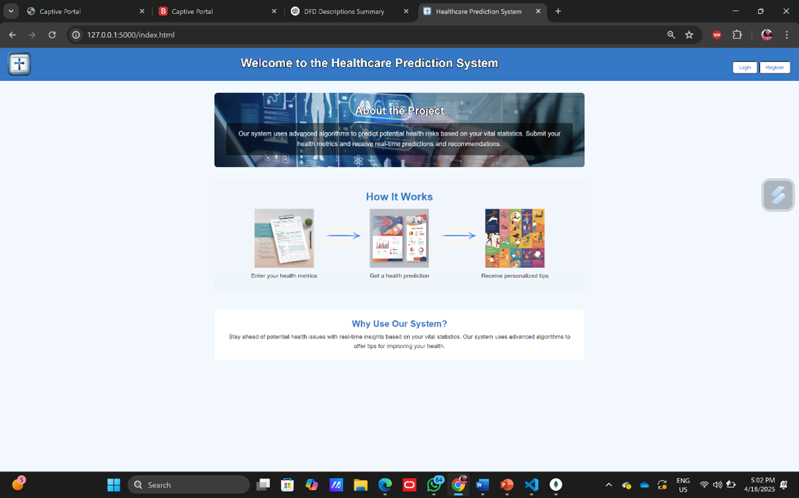
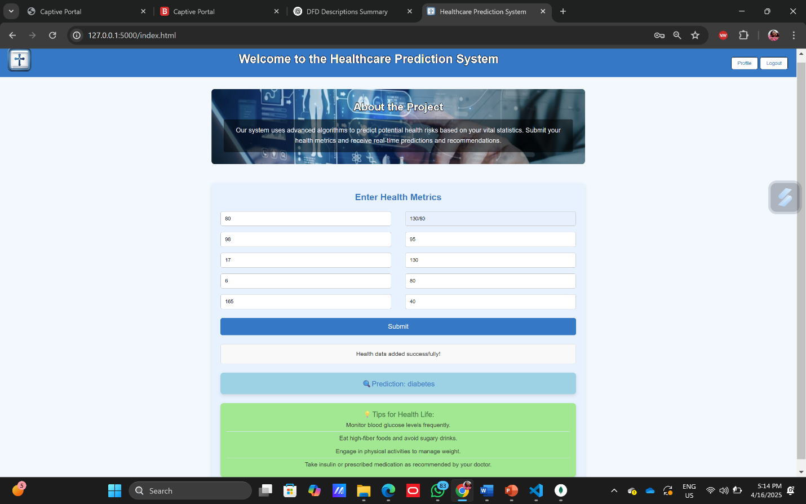

# 🏥 Healthcare Prediction System

A full-stack web application that predicts various health risks using machine learning. It includes data preprocessing, model training, RESTful APIs, and a clean frontend interface. Ideal for use cases like preventive diagnosis, patient intake forms, or risk analysis dashboards.

---

## 🚀 Features
- 🧠 ML-powered health risk prediction
- 🌐 REST API using Flask and Node.js
- 🖥️ Frontend interface for user input and result display
- 🗃️ MongoDB integration for data storage
- 📊 Model training and evaluation scripts
- 🔐 Secure password handling with bcrypt
- 📦 Modular architecture for easy extension

---

## 🛠️ Tech Stack

| Layer         | Technology                      |
|---------------|----------------------------------|
| Frontend      | HTML, CSS, JavaScript, Serve     |
| Backend       | Node.js, Express, Flask (Python) |
| ML            | Python, scikit-learn             |
| Database      | MongoDB                          |
| Deployment    | Nodemon, Waitress, Serve         |

---

## 📁 Folder Structure

```
Healthcare_Prediction_System/
├── implementation/
│   ├── frontend/         # Frontend code (HTML/CSS/JS)
│   ├── backend/          # Node.js backend
│   └── ml/               # ML model and training scripts
├── tests/                # Unit tests
├── .gitignore
├── package.json
└── README.md
```

---

## ⚙️ Setup Instructions

### ✅ Prerequisites
- Node.js and npm
- Python 3.x
- MongoDB installed and running locally
- Git

### 📦 1. Clone the Repository
```bash
git clone https://github.com/iamaastharawat/Healthcare_Prediction_System.git
cd Healthcare_Prediction_System
```

### 📁 2. Install Dependencies

#### Backend (Node.js)
```bash
npm install
```

#### Python (ML + Flask)
```bash
pip install -r requirements.txt
# (Manually create this file with necessary libs like Flask, scikit-learn, pandas, etc.)
```

### 🔧 3. Train the ML Model
```bash
npm run trainData      # Preprocess and prepare dataset
npm run train          # Train the ML model
```

### 🔌 4. Run the Backend Servers
```bash
npm run backend        # Node.js Express backend
npm run flask          # Flask ML API (runs on port 5001)
```

### 🌐 5. Start Frontend
```bash
npm run frontend       # Serves frontend via Serve
```

---

## 🧪 Running Tests
```bash
npm run unitTestModel
```

---

## 📬 API Endpoints

| Method | Endpoint    | Description                      |
|--------|-------------|----------------------------------|
| POST   | /predict    | Predict health risk using model |
| POST   | /insertData | Insert user data into DB        |

---

## 📸 Screenshots
### 🔹 Home Page


### 🔹 Prediction Page


---

## 📄 License
This project is licensed under the ISC License.

